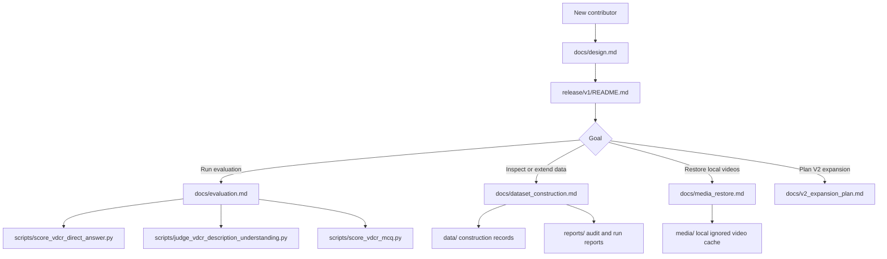

# DynaKnow-Video

DynaKnow-Video is a benchmark for **dynamic video concept recognition**. The
core question is whether a model can identify the named concept instantiated by
a temporally evolving process in a video, rather than relying on object labels,
static frames, subtitles, source titles, or generic event captions.

Current benchmark task:

```text
Which named dynamic concept is instantiated by the temporally evolving process in this video?
```

The current runnable package is the **VDCR v1 direct-answer pilot release**:

- Dataset: `release/v1/dataset_v1.jsonl`
- MCQ variant: `release/v1/dataset_v1_mcq_seed20260619.jsonl`
- Provenance manifest: `release/v1/manifest_v1.csv`
- Release notes and validation command: `release/v1/README.md`

The release contains 114 source-hidden samples across four domains:
biology/living systems, chemistry/materials change, earth/environmental systems,
and physics/physical systems.

## How To Read This Repository

Start here if you are new to the benchmark:

1. Read `docs/design.md` for the benchmark goal and task definition.
2. Read `release/v1/README.md` to understand the current runnable release.
3. Read `docs/dataset_construction.md` to understand how samples are built and
   filtered.
4. Read `docs/evaluation.md` to understand the three reporting metrics.
5. Read `docs/media_restore.md` before running media validation or video model
   evaluation on a fresh checkout.
6. Read `docs/v2_expansion_plan.md` for the planned path from the v1 pilot to a
   larger concept-clustered V2.



## Repository Map

- `release/v1/`: current source-hidden evaluation snapshot. This is the
  primary entry point for running the benchmark.
- `docs/`: design, construction, annotation, source/leakage, and evaluation
  documentation.
- `data/`: structured construction records and intermediate artifacts used to
  build and audit the benchmark. This is provenance, not the clean model-facing
  release.
- `reports/`: construction audits, dashboards, model outputs, score reports,
  run summaries, and capacity assessments.
- `scripts/`: utilities for candidate collection, media processing, validation,
  release export, model runs, and scoring.
- `schemas/`: JSON/CSV contracts for samples, manifests, and review artifacts.
- `templates/`: starter sheets and example manifest/sample files.
- `media/`: local video and frame cache. It is intentionally ignored by git but
  required for `--check-media` validation and video model evaluation.

## Current Evaluation Protocol

VDCR v1 should be reported with three separate metrics:

```text
open exact naming | open description judge | MCQ recognition
```

- Open exact naming measures canonical concept recall using alias-normalized
  exact match.
- Open description judge measures mechanism-level understanding even when the
  canonical term is missing.
- MCQ recognition measures closed-set discrimination among plausible candidate
  concepts.

Do not collapse these into one score. They answer different questions about
model behavior and usually follow:

```text
open exact naming <= open description judge <= MCQ recognition
```

See `docs/evaluation.md` for commands and interpretation.

## Validate The Current Release

The validation command checks source hiding, schema fields, quality gates, domain
balance, media existence, and basic video decodability:

```bash
python3 scripts/validate_vdcr_direct_answer.py \
  --input release/v1/dataset_v1.jsonl \
  --release-mode \
  --check-media \
  --min-samples 100 \
  --min-duration-sec 1.0 \
  --min-video-frames 2 \
  --max-domain-imbalance 1
```

If this fails with missing `media/...` files, read `docs/media_restore.md`.

## Construction Logic

The construction pipeline is:

```text
concept inventory / taxonomy
-> public source candidate collection
-> media download or local segment creation
-> dynamic-process eligibility review
-> mechanism/concept anchoring
-> leakage and shortcut review
-> source-hidden direct-answer release
-> optional MCQ derivation
-> evaluation reports
```

Every accepted item must pass the main gates:

- visible evidence across time;
- single-frame insufficiency;
- mechanism-bearing concept label;
- bounded source use;
- no answer leakage from source metadata, OCR, subtitles, narration, or titles;
- release JSONL hides provenance fields;
- local media exists and decodes.

See `docs/dataset_construction.md` for the detailed gate sequence.

## V2 Scaling Direction

V2 should scale by treating the data unit as a `video-concept sample` and
grouping repeated concepts into `concept clusters`. The main set can include
multiple videos for the same mechanism when each video is clean, visually
distinct, and independently grounded. The default cap is up to 3 main-set videos
per concept, with concept-balanced reporting to avoid over-weighting repeated
concepts.

See `docs/v2_expansion_plan.md` for the expansion rules.

Current V2 planning recommends 240 video-concept samples as the first target,
with 160-180 unique concepts and up to 3 main-set videos per concept cluster.
See `reports/v2_capacity_assessment.md` for the current capacity estimate.

Current V2 construction assets:

- Seed samples from the formal v1 release: `data/vdcr_v2_seed_samples.jsonl`
- Source-deduplicated candidate pool: `data/vdcr_candidate_videos_combined_v2.csv`
- Main-set review queue: `data/vdcr_v2_review_queue.csv`
- Local review triage sheet: `data/vdcr_v2_local_review_triage.csv`
- Draft source-hidden samples: `data/vdcr_v2_draft_samples.jsonl`
- Expansion backlog: `data/vdcr_v2_expansion_backlog.csv`
- Expansion retrieval queries: `data/vdcr_v2_expansion_queries.csv`
- Review dashboard: `reports/vdcr_v2_review_dashboard.html`
- Construction status: `reports/vdcr_v2_construction_status.md`
- Local review triage status: `reports/vdcr_v2_local_review_triage.md`
- Draft status: `reports/vdcr_v2_draft_status.md`
- Expansion status: `reports/vdcr_v2_expansion_backlog.md`

Regenerate them with:

```bash
python3 scripts/build_vdcr_v2_construction_assets.py
python3 scripts/build_vdcr_v2_review_triage.py
python3 scripts/apply_vdcr_v2_triage_decisions.py
python3 scripts/build_vdcr_v2_draft_samples.py
python3 scripts/build_vdcr_v2_expansion_backlog.py
python3 scripts/build_vdcr_review_dashboard.py \
  --review-csv data/vdcr_v2_review_queue.csv \
  --samples data/vdcr_v2_seed_samples.jsonl \
  --concepts data/vdcr_concept_inventory_tiered_v1.csv \
  --candidates data/vdcr_candidate_videos_combined_v2.csv \
  --output reports/vdcr_v2_review_dashboard.html
```

The main V2 queue excludes specialized action concepts by default. Use
`--include-action-concepts` only for an optional ablation queue, not for the
primary VDCR V2 benchmark.

## Important Working Rule

Do not delete `media/` as routine cleanup. It is ignored by git because video
files are large, but it is still required local state for benchmark execution.
Use `docs/media_restore.md` if the cache needs to be rebuilt.
